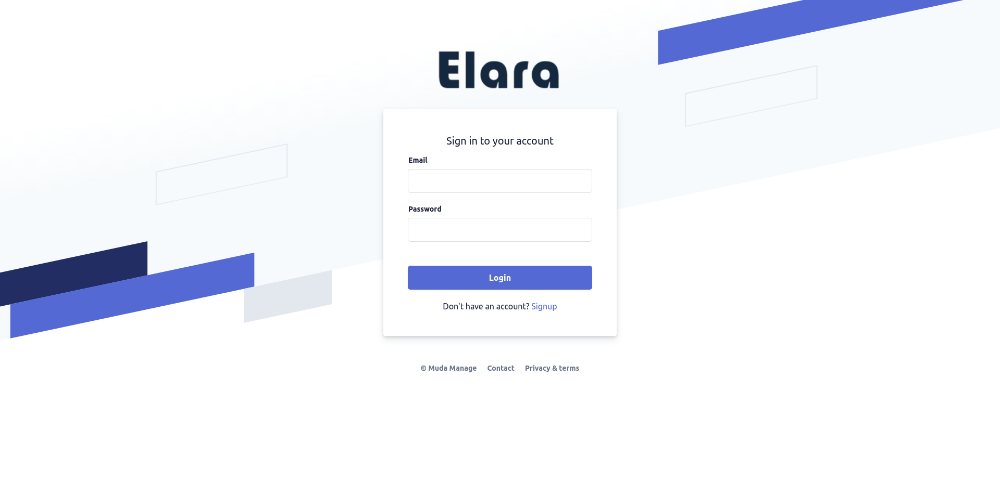
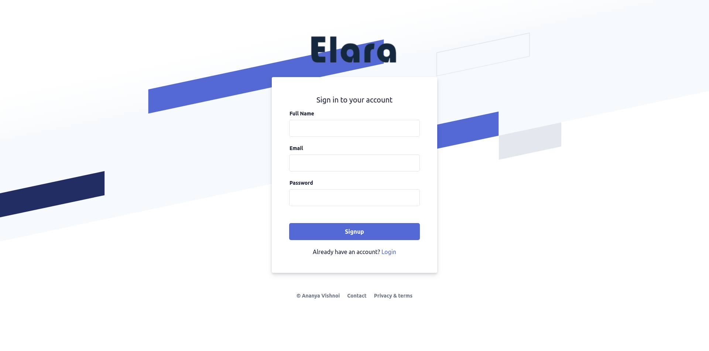
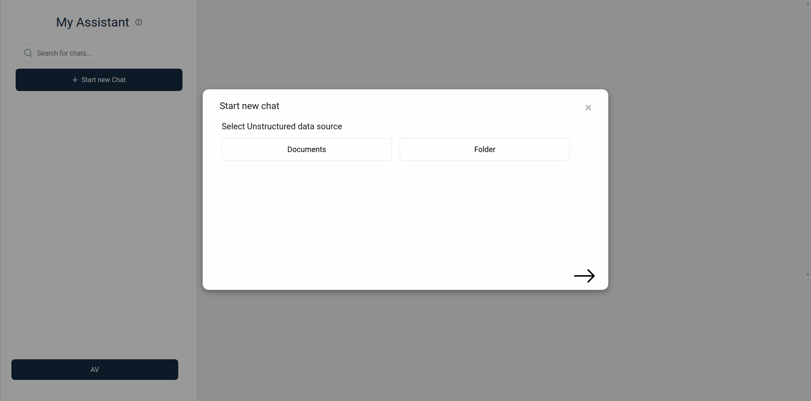
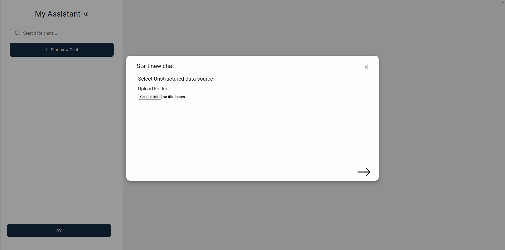
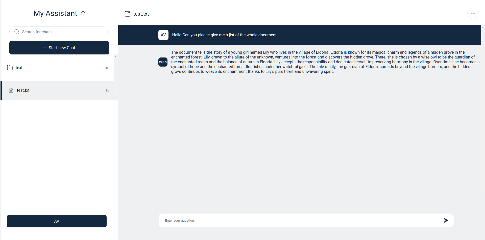
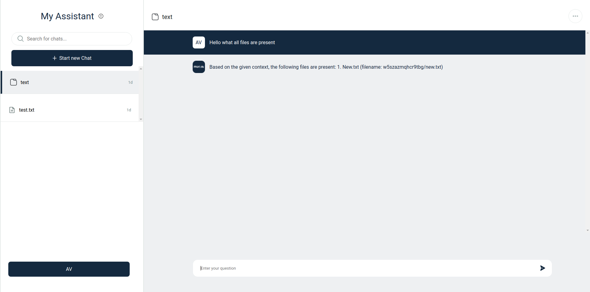

# Project Information

This project constitutes a web application designed to facilitate user communication through various file formats, including documents (docs), PDFs, Excel sheets (xlsx), CSV files, and more. With additional development time, we can extend its capabilities to support image files, PowerPoint presentations (PPT), websites, and GitHub repositories as well. The implementation utilizes the Django Rest Framework, Langchain, Llamaindex, and the OpenAI library. Rigorous testing has demonstrated a commendable 98% accuracy in handling PDFs, DOCX files, XLSX files, CSV files, and plain text (TXT) files. The system employs a dual retrieval method to enhance its functionality.

This project opts for a closed-source GPT architecture over open-source LLM, like LLama2, due to encountered technical challenges. LLama2 demands a substantial amount of RAM, approximately 32 GB, for optimal functionality, rendering it impractical for deployment on local laptops. Even when quantized to operate on a 12GB Google Colab environment, LLama2 did not yield superior accuracy compared to the GPT architecture. Consequently, the GPT architecture emerged as both technically and financially viable for the intended use case. Nevertheless, for specific applications such as code generation in future projects, further research on open-source models can be explored.

# Application

Its applications are diverse, catering to a spectrum of users ranging from students revising their notes on the eve of an exam to experienced data analysts seeking connections within numerous CSV and Excel sheets. Lawyers can leverage it to upload PDFs and engage in discussions about legal case studies, fostering a deeper understanding. Medical professionals find utility in using it for in-depth exploration of medical case studies, while programmers can employ it to comprehend and converse about documentation. Teachers can efficiently tackle entire papers and beyond. The versatility of this tool extends to numerous other use cases, showcasing its adaptability and broad utility.

# Setup

## Virtual Environment


To ensure a clean and organized development environment, it is highly recommended to use a virtual environment when working with any project. You can create a virtual environment for your project by running the following command in your terminal:

```bash
python -m venv <name of virtual environment>
```

Once your virtual environment is created, you can activate it using the appropriate command for your operating system.

Windows:
```bash
.\<name of virtual environment>\Scripts\activate
```

Linux/Unix:
```bash
source <name of virtual environment>/bin/activate
```

By activating your virtual environment, you can ensure that any dependencies and packages you install will be isolated from your global environment, making it easier to manage and maintain your project.

## .env

<b> Important Note: </b>
Please make your own .env from demo.env file and add your own credentials.

## Running Project
 
To install all the necessary dependencies for your project, simply run the following command in your terminal:

```bash
pip install -r requirements.txt
```
This command will read the requirements.txt file and automatically install all the listed dependencies for you. Make sure your virtual environment is activated before running this command to ensure that the packages are installed in the correct environment. Once the installation is complete, you'll be ready to start working on your project!

Next run the following command in your terminal to start the project:

```bash
python manage.py makemigrations
python manage.py migrate
python manage.py runserver
```

# Project Features

## Login

A user can simple login using email and password




## Register

A user can register using his email, password and also recieve and OTP on his email for verification



## Uploading Document

To facilitate the upload process, the system accommodates single-document uploads limited to the following allowed formats: .pdf, .docx, .xlsx, and .csv. Users can seamlessly upload a single document in any of these permitted formats.




## Uploading Folders

For scenarios where the objective is to establish relationships among multiple files, the system supports the upload of entire folders. Users can conveniently select and upload an entire folder, enabling simultaneous interaction and analysis of multiple files within that specific directory. This functionality enhances the system's versatility, catering to both singular document-focused interactions and broader file relations within uploaded folders.



## Chat

The chat feature is the core of the application. It allows users to interact with a single or multiple documents at once. 




## Video demonstration
[](Readme_images/elara.webm)


## Video Explaination

https://www.loom.com/share/b6457f150caf4aa691c5352e4e3736a1?sid=466a7935-1bd1-4398-9be5-2684a6bff5ba